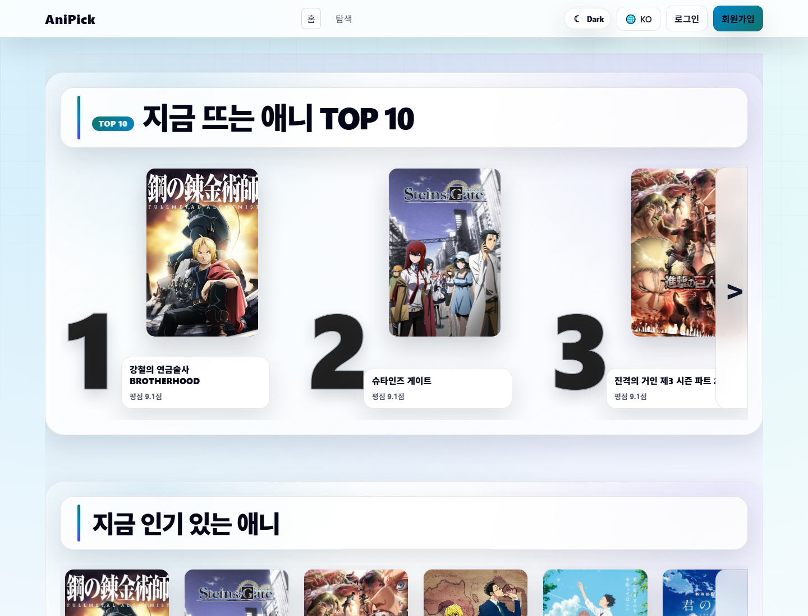
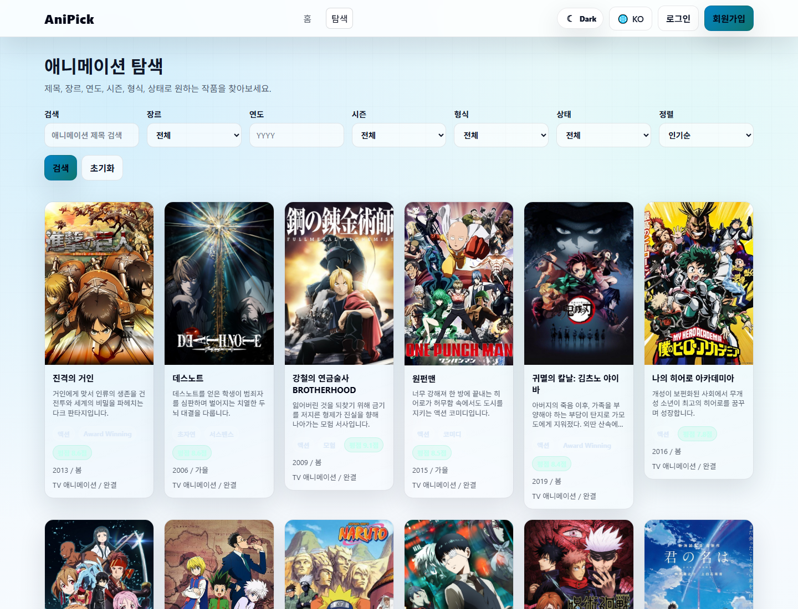
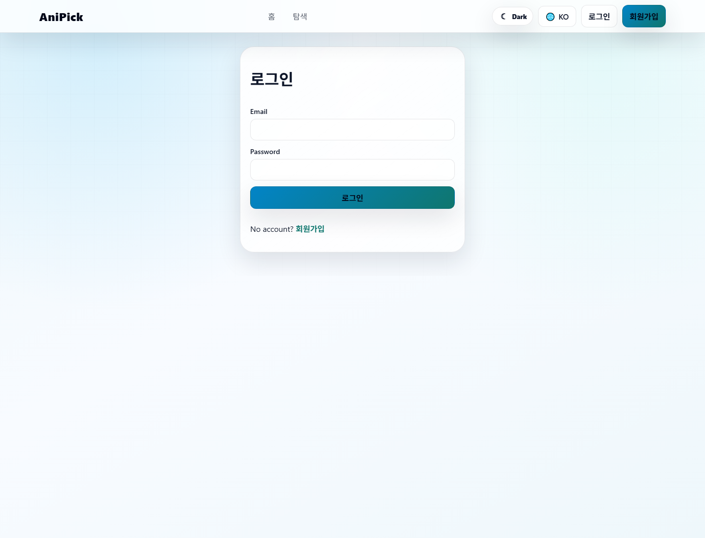

# AniPick

AniPick은 애니메이션을 추천, 탐색, 리뷰하고 개인 시청 상태를 관리할 수 있는 웹 서비스입니다. React + Vite 프론트엔드와 Node.js Express + Prisma 백엔드, PostgreSQL DB로 구성된 풀스택 프로젝트이며, 로컬 제출/검증 환경에서는 Docker Compose 한 번으로 전체 서비스를 실행할 수 있습니다.

공개 배포 사이트는 Synology NAS에서 동작합니다. 해당 NAS는 `armv7l` 기반 환경으로 Docker 명령을 사용할 수 없어, 운영 배포에서는 정적 프론트엔드 파일과 `backend/src/server-nas.js` 경량 Node API 서버를 사용합니다. 즉, GitHub 저장소에는 Docker/Prisma/PostgreSQL 기반 전체 소스가 포함되어 있고, 실제 공개 URL은 NAS 환경에 맞춘 non-Docker 런타임으로 운영됩니다.

이 프로젝트는 단순 목록 페이지가 아니라 다음 흐름을 하나의 서비스로 연결합니다.

1. Jikan/AniList에서 애니메이션 원본 메타데이터를 수집한다.
2. 수집한 데이터를 PostgreSQL에 캐시한다.
3. 한국어/영어/일본어 제목과 설명은 `AnimeTranslation` 테이블에 저장한다.
4. 사용자는 언어만 선택하고, 백엔드는 저장된 번역을 빠르게 반환한다.
5. OpenAI 번역은 사용자 페이지 요청 중 절대 실행하지 않고, 관리자/CLI 배치 작업에서만 수행한다.
6. 관리자 페이지에서 애니 숨김, 성인 콘텐츠 표시, 번역 상태 확인, 누락 번역 작업 생성/실행이 가능하다.

## 1. 핵심 요약

| 항목 | 내용 |
| --- | --- |
| 프로젝트명 | AniPick |
| 목적 | 애니메이션 추천, 탐색, 리뷰, 시청 상태 관리 |
| 프론트엔드 | React, Vite, React Router, Axios |
| 백엔드 | Node.js, Express, Prisma |
| DB | PostgreSQL |
| 외부 API | Jikan, AniList |
| 번역 | OpenAI 기반 사전 번역, DB 캐시 저장 |
| 실행 방식 | 로컬/제출 검증: Docker Compose, 공개 배포: NAS non-Docker 런타임 |
| 기본 접속 | `http://localhost:5173/` |
| 백엔드 상태 확인 | `http://localhost:4001/health` |
| 공개 배포 URL | `http://222.239.185.184/Anipick/` |
| 공개 API 상태 | `http://222.239.185.184/Anipick-api/health` |

## 0. 공개 배포 사이트

GitHub 저장소를 직접 내려받지 않아도 아래 주소에서 배포된 AniPick을 바로 확인할 수 있습니다.

```text
Site: http://222.239.185.184/Anipick/
API Health: http://222.239.185.184/Anipick-api/health
Example Detail: http://222.239.185.184/Anipick/anime/59845
```

GitHub Repository는 소스 코드, 커밋 이력, 실행 방법, 프론트엔드/백엔드 구현을 확인하는 용도입니다. 실제 실행 중인 웹사이트는 GitHub Pages가 아니라 아래 NAS 공개 URL에서 확인합니다.

배포 환경은 Synology NAS입니다. NAS 장비가 `armv7l` 환경이고 `docker` 명령을 사용할 수 없어, 운영 배포에서는 Docker 컨테이너를 사용하지 않습니다. 대신 Vite 정적 빌드 파일을 NAS Web Station 경로에 배치하고, `backend/src/server-nas.js` 경량 API 서버를 Node.js 프로세스로 실행합니다.

로컬/Docker 제출 환경은 기존 Express + Prisma + PostgreSQL 구조를 그대로 사용합니다. 즉, 제출용 코드와 DB 스키마 검증은 `backend/prisma/schema.prisma` 기준이며, NAS 운영 서버는 실제 웹 접속을 위해 같은 API 계약을 맞춘 배포용 런타임입니다.

NAS 배포 구성:

```text
Frontend static files: /volume1/web/Anipick
Backend runtime: /volume1/docker/Anipick/backend
Runtime JSON store: /volume1/docker/Anipick/runtime/nas-store.json
Public frontend path: /Anipick/
Public API proxy path: /Anipick-api/
Internal backend port: 127.0.0.1:4001
Runtime process: node src/server-nas.js
Container runtime on NAS: not used
```

`/volume1/docker/Anipick`는 NAS에 만들어 둔 운영 파일 보관 폴더명일 뿐이며, 실제 Docker 컨테이너가 실행되는 경로가 아닙니다.

확인된 공개 동작:

- 홈/탐색/상세 라우트가 `200 OK`로 열림
- `/Anipick-api/anime/trending?lang=ko`, `lang=en`, `lang=ja` 응답 확인
- `/Anipick-api/anime/59845?lang=ko` 제목이 `향기로운 꽃은 늠름하게 핀다`로 표시됨
- `/Anipick-api/health` 상태 확인 응답 `200 OK`
- 회원가입/로그인 API 동작 확인
- NAS 백엔드는 부팅 시 `/usr/local/etc/rc.d/anipick.sh`로 재시작되도록 등록

## 2. 전체 기능 소개

### 2.1 사용자 기능

- 홈 화면에서 넷플릭스형 가로 카드 슬라이더 제공
- `지금 뜨는 애니 TOP 10` 순위형 카드 표시
- `지금 인기 있는 애니`, `이번 시즌 인기작`, `고평점 추천` 섹션 제공
- 애니메이션 탐색 페이지에서 제목, 장르, 연도, 시즌, 형식, 상태, 정렬 조건으로 검색
- 애니 상세 페이지에서 포스터, 배너, 장르, 평점, 인기도, 시즌, 형식, 설명 확인
- 한국어, 영어, 일본어 언어 선택 지원
- 회원가입 및 로그인
- 찜하기 기능
- 시청 상태 관리
  - 볼 예정
  - 보는 중
  - 시청 완료
  - 중단
- 리뷰 작성 및 내 리뷰 확인
- 마이페이지에서 찜 목록, 시청 상태, 추천, 내 리뷰 확인

### 2.2 관리자 기능

관리자 계정으로 로그인하면 `/admin`에서 다음 작업을 수행할 수 있습니다.

- 사용자 목록 조회
- 전체 리뷰 조회 및 삭제
- 공지 관리
- 애니 관리
  - 애니 목록 조회
  - 내부 DB id, externalId, provider, 제목, 상태 확인
  - 숨김 처리
  - 성인 콘텐츠 표시
  - 복구
  - 삭제 처리, 기본은 archive/soft delete
- 번역 관리
  - 번역 커버리지 확인
  - 누락 번역 목록 확인
  - 번역 작업 생성
  - 번역 작업 실행
  - 수동 번역 저장
  - 자동 번역 검수 승인
  - 실패 번역 재시도
- OpenAI 번역 모델 접근 가능 여부 확인

### 2.3 데이터 품질 관리 기능

- 표지 이미지, 평점, 인기도가 부족한 Anime 캐시 진단
- Jikan 상세 API 기반 누락 이미지/평점 갱신
- ghost anime row dry-run 정리
- 중복 Anime row 후보 탐지
- 성인/Hentai/Erotica 콘텐츠 자동 숨김 처리
- 사용자 데이터가 연결된 Anime row는 보수적으로 보존

### 2.4 다국어와 번역 정책

- 사용자 조회 API에서는 OpenAI를 호출하지 않습니다.
- 페이지 로딩 중 실시간 번역을 하지 않습니다.
- `AnimeTranslation` 테이블에 저장된 번역만 반환합니다.
- 번역이 없는 제목은 영어/로마자 fallback을 사용합니다.
- 설명 번역이 없을 때만 “한국어 번역이 준비 중입니다.” 같은 안내 문구를 표시합니다.
- 공식 한국어 제목은 `backend/src/data/animeTranslations.js`에 seed로 고정할 수 있습니다.

예시:

```text
The Fragrant Flower Blooms with Dignity
→ 향기로운 꽃은 늠름하게 핀다
```

## 3. 화면 구성

| 경로 | 설명 |
| --- | --- |
| `/` | 홈, TOP 10/인기/시즌/고평점 슬라이더 |
| `/browse` | 탐색 및 필터 검색 |
| `/anime/:id` | 애니 상세 페이지, `id`는 Jikan/MAL externalId 기준 |
| `/login` | 로그인 |
| `/register` | 회원가입 |
| `/mypage` | 찜, 시청 상태, 추천, 내 리뷰 |
| `/admin` | 관리자 대시보드 |

## 4. 백엔드 API 요약

### 4.1 사용자 API

| Method | Path | 설명 |
| --- | --- | --- |
| GET | `/health` | 서버 상태 확인 |
| GET | `/api/anime/trending` | 인기/트렌딩 애니 목록 |
| GET | `/api/anime/popular-season` | 이번 시즌 인기작 |
| GET | `/api/anime/search` | 검색/필터 목록 |
| GET | `/api/anime/:id` | 애니 상세 |
| GET | `/api/anime/recommendations` | 사용자 기반 추천, 로그인 필요 |
| POST | `/api/auth/register` | 회원가입 |
| POST | `/api/auth/login` | 로그인 |
| GET | `/api/auth/me` | 현재 로그인 사용자 |
| GET/POST/DELETE | `/api/favorites` | 찜 관리 |
| GET/POST/DELETE | `/api/watch-status` | 시청 상태 관리 |
| GET/POST/DELETE | `/api/reviews` | 리뷰 관리 |

### 4.2 관리자 API

| Method | Path | 설명 |
| --- | --- | --- |
| GET | `/api/admin/users` | 사용자 목록 |
| GET | `/api/admin/reviews` | 전체 리뷰 목록 |
| DELETE | `/api/admin/reviews/:id` | 리뷰 삭제 |
| GET | `/api/admin/anime` | 관리자 애니 목록 |
| PATCH | `/api/admin/anime/:id/hide` | 숨김 처리 |
| PATCH | `/api/admin/anime/:id/unhide` | 복구 |
| PATCH | `/api/admin/anime/:id/mark-adult` | 성인 콘텐츠 표시 |
| DELETE | `/api/admin/anime/:id` | archive 삭제 처리 |
| GET | `/api/admin/translations/coverage` | 번역 커버리지 |
| GET | `/api/admin/translations/missing` | 누락 번역 목록 |
| POST | `/api/admin/translations/jobs` | 번역 작업 생성 |
| POST | `/api/admin/translations/jobs/run` | 번역 작업 실행 |
| PUT | `/api/admin/translations/:provider/:externalId` | 수동 번역 저장 |
| POST | `/api/admin/translations/:provider/:externalId/review` | 번역 검수 승인 |
| POST | `/api/admin/translations/:provider/:externalId/retry` | 실패 번역 재시도 |

## 5. 프로젝트 구조

```text
AniPick/
├─ backend/
│  ├─ prisma/
│  │  ├─ schema.prisma
│  │  ├─ seed.js
│  │  └─ migrations/
│  ├─ scripts/
│  │  ├─ prefetchAnime.js
│  │  ├─ pretranslateAnime.js
│  │  ├─ createTranslationJobs.js
│  │  ├─ repairAnimeCache.js
│  │  └─ translationCoverage.js
│  ├─ src/
│  │  ├─ controllers/
│  │  ├─ routes/
│  │  ├─ services/
│  │  ├─ utils/
│  │  ├─ middlewares/
│  │  ├─ data/
│  │  ├─ app.js
│  │  └─ server.js
│  ├─ Dockerfile
│  └─ package.json
├─ frontend/
│  ├─ src/
│  │  ├─ api/
│  │  ├─ components/
│  │  ├─ context/
│  │  ├─ hooks/
│  │  ├─ pages/
│  │  ├─ styles/
│  │  └─ utils/
│  ├─ Dockerfile
│  ├─ vite.config.js
│  └─ package.json
├─ docs/
│  ├─ anipick_execution_report.html
│  └─ screenshots/
├─ docker-compose.yml
└─ README.md
```

## 6. 로컬/제출 검증 환경에서 Docker로 전체 실행하기

이 섹션은 개인 PC, 실습실 PC, 채점자가 내려받은 로컬 환경에서 전체 프론트엔드/백엔드/DB를 실행하는 방법입니다. 공개 NAS 배포 서버는 Docker를 사용하지 않으며, NAS 운영 방식은 `0. 공개 배포 사이트` 섹션을 따릅니다.

### 6.1 사전 준비

- Docker Desktop 실행
- Git 설치
- 프로젝트 클론 또는 압축 해제

### 6.2 한 번에 실행

프로젝트 루트에서 실행합니다.

```powershell
cd "C:\Users\shy\Documents\4학년 1학기\OSS\애니 클론사이트 만들기\AniPick"
docker compose up --build
```

백그라운드 실행:

```powershell
docker compose up --build -d
```

### 6.3 접속 주소

```text
Frontend: http://localhost:5173/
Backend health: http://localhost:4001/health
Backend Swagger: http://localhost:4001/api-docs
PostgreSQL: localhost:5433
```

### 6.4 상태 확인

```powershell
docker compose ps
```

정상 예시:

```text
anipick_postgres   Up   healthy   0.0.0.0:5433->5432/tcp
anipick_backend    Up   healthy   0.0.0.0:4001->4001/tcp
anipick_frontend   Up             0.0.0.0:5173->5173/tcp
```

### 6.5 로그 확인

```powershell
docker compose logs -f
```

특정 서비스 로그:

```powershell
docker compose logs -f backend
docker compose logs -f frontend
docker compose logs -f postgres
```

### 6.6 중지

```powershell
docker compose down
```

### 6.7 DB까지 완전 초기화

```powershell
docker compose down -v
docker compose up --build -d
```

주의: `down -v`는 DB 볼륨을 삭제합니다. 회원, 리뷰, 찜, 시청 상태, 캐시 데이터가 모두 초기화됩니다.

## 7. 로컬 수동 실행 방법

Docker 전체 실행 대신 직접 실행하려면 터미널을 3개 사용합니다.

### 7.1 DB만 Docker로 실행

```powershell
cd "C:\Users\shy\Documents\4학년 1학기\OSS\애니 클론사이트 만들기\AniPick"
docker compose up -d postgres
```

### 7.2 백엔드 실행

```powershell
cd "C:\Users\shy\Documents\4학년 1학기\OSS\애니 클론사이트 만들기\AniPick\backend"
npm install
npx prisma generate
npx prisma migrate dev
npm run seed
npm run dev
```

### 7.3 프론트엔드 실행

```powershell
cd "C:\Users\shy\Documents\4학년 1학기\OSS\애니 클론사이트 만들기\AniPick\frontend"
npm install
npm run dev
```

## 8. 기본 계정

seed 실행 시 관리자 계정이 생성됩니다.

```text
Email: admin@anipick.com
Password: admin1234
```

## 9. DB가 부족할 때 업데이트하는 법

홈/탐색 화면에 데이터가 부족하거나 이미지, 평점, 번역이 비어 있으면 아래 순서로 보강합니다.

### 9.1 Prisma 마이그레이션 적용

Docker 환경:

```powershell
docker compose exec backend npx prisma migrate deploy
```

로컬 환경:

```powershell
cd backend
npx prisma migrate dev
```

### 9.2 seed 데이터 반영

```powershell
docker compose exec backend npm run seed
```

seed에는 다음 데이터가 포함됩니다.

- 관리자 계정
- 주요 애니 한국어/영어/일본어 제목
- 주요 애니 설명 번역
- 공식 한국어 제목 매핑

### 9.3 원본 애니 데이터 수집

Jikan/AniList에서 원본 메타데이터를 가져와 `Anime` 테이블에 저장합니다.

```powershell
docker compose exec backend npm run anime:prefetch
```

또는 기존 스크립트명:

```powershell
docker compose exec backend npm run prefetch:anime
```

### 9.4 캐시 품질 보정

먼저 dry-run으로 진단합니다.

```powershell
docker compose exec backend npm run anime:repair
```

누락된 이미지, 평점, 인기도 갱신:

```powershell
docker compose exec backend npm run anime:repair -- --refresh-missing --limit=100
```

중복 후보 확인:

```powershell
docker compose exec backend npm run anime:repair -- --dedupe
```

ghost row 정리 후보 확인:

```powershell
docker compose exec backend npm run anime:repair -- --cleanup-ghosts
```

전체 보정 실제 적용:

```powershell
docker compose exec backend npm run anime:repair -- --all --apply
```

성인 콘텐츠 자동 감지 및 숨김 처리:

```powershell
docker compose exec backend npm run anime:repair -- --mark-adult --apply
```

## 10. 한국어 번역 다시 돌리는 법

중요 정책:

- 일반 사용자 API 호출 중 OpenAI를 호출하지 않습니다.
- 홈, 탐색, 상세 페이지 로딩 중 실시간 번역하지 않습니다.
- 번역은 CLI 배치 또는 관리자 수동 실행에서만 수행합니다.
- Docker 기본 실행에서는 OpenAI 키를 자동 주입하지 않습니다.

### 10.1 누락 번역 작업 생성

한국어만:

```powershell
docker compose exec backend npm run anime:jobs:create -- --langs=ko --limit=1000
```

한국어/일본어:

```powershell
docker compose exec backend npm run anime:jobs:create -- --langs=ko,ja --limit=1000
```

### 10.2 번역 작업 실행

한국어만:

```powershell
docker compose exec -e OPENAI_API_KEY="YOUR_OPENAI_API_KEY" backend npm run anime:translate -- --langs=ko --limit=200
```

한국어/일본어:

```powershell
docker compose exec -e OPENAI_API_KEY="YOUR_OPENAI_API_KEY" backend npm run anime:translate -- --langs=ko,ja --limit=200
```

### 10.3 번역 상태 확인

```powershell
docker compose exec backend npm run anime:coverage
```

또는 관리자 페이지에서 번역 커버리지를 확인합니다.

### 10.4 공식 한국어 제목을 고정하는 법

공식 제목은 GPT 자동 번역보다 seed에 고정하는 것을 권장합니다.

파일:

```text
backend/src/data/animeTranslations.js
```

예시:

```js
59845: {
  koTitle: '향기로운 꽃은 늠름하게 핀다',
  enTitle: 'The Fragrant Flower Blooms with Dignity',
  jaTitle: '薫る花は凛と咲く',
},
```

반영:

```powershell
docker compose exec backend npm run seed
```

## 11. 실제 검증 시나리오

### 11.1 홈 화면 실행 확인

1. `docker compose up --build -d`
2. `http://localhost:5173/` 접속
3. TOP 10, 인기 애니, 시즌 인기작, 고평점 추천 슬라이더 확인
4. 카드 클릭 시 상세 페이지로 이동하는지 확인

캡쳐:



### 11.2 탐색 화면 실행 확인

1. `http://localhost:5173/browse` 접속
2. 검색, 장르, 연도, 시즌, 형식, 상태, 정렬 필터 확인
3. 카드 목록이 이미지/평점과 함께 표시되는지 확인

캡쳐:



### 11.3 상세 페이지 한국어 번역 확인

1. `http://localhost:5173/anime/59845` 접속
2. 한국어 모드 확인
3. 제목이 아래처럼 보이는지 확인

```text
The Fragrant Flower Blooms with Dignity
→ 향기로운 꽃은 늠름하게 핀다
```

캡쳐:


### 11.4 로그인 화면 확인

1. `http://localhost:5173/login` 접속
2. 로그인 폼 표시 확인
3. 관리자 계정 또는 일반 회원 계정으로 로그인 가능

캡쳐:



## 12. 현재 검증 결과

검증일: 2026-06-19

| 항목 | 결과 |
| --- | --- |
| GitHub Repository | `https://github.com/shy0401/AniPick` 접근 가능 |
| 공개 프론트엔드 | `http://222.239.185.184/Anipick/` HTTP 200 |
| 공개 백엔드 상태 확인 | `http://222.239.185.184/Anipick-api/health` HTTP 200 |
| 공개 트렌딩 API | `/Anipick-api/anime/trending?lang=ko`, `lang=en`, `lang=ja` HTTP 200 |
| 공개 상세 API | `/Anipick-api/anime/59845?lang=ko` HTTP 200 |
| NAS Docker 여부 | `docker: command not found`, 운영 배포는 non-Docker |
| NAS 백엔드 프로세스 | `node src/server-nas.js` 실행 중 |
| NAS 웹 서버 | nginx로 `/Anipick/`, `/Anipick-api/` 라우팅 |
| `59845` 한국어 제목 | `향기로운 꽃은 늠름하게 핀다` |
| 로컬 Docker Compose | `docker-compose.yml` 제공, 로컬/제출 검증용 |

## 13. HTML 보고서

브라우저로 아래 파일을 열면 실행 보고서를 볼 수 있습니다.

```text
docs/anipick_execution_report.html
```

PowerShell:

```powershell
start "" "C:\Users\shy\Documents\4학년 1학기\OSS\애니 클론사이트 만들기\AniPick\docs\anipick_execution_report.html"
```

## 14. 문제 해결 가이드

### 14.1 프론트에서 `ECONNREFUSED`가 보임

원인: 백엔드 또는 DB가 실행 중이 아닙니다.

해결:

```powershell
docker compose up --build -d
docker compose ps
```

### 14.2 로그인/회원가입이 안 됨

백엔드 health를 먼저 확인합니다.

```powershell
Invoke-WebRequest http://localhost:4001/health
```

정상 응답:

```json
{"message":"AniPick backend is running."}
```

### 14.3 애니 카드가 비어 보임

DB 캐시가 부족할 수 있습니다.

```powershell
docker compose exec backend npm run anime:prefetch
docker compose exec backend npm run anime:repair -- --refresh-missing --limit=100
```

### 14.4 한국어 제목이 영어로 보임

seed와 번역 작업을 다시 실행합니다.

```powershell
docker compose exec backend npm run seed
docker compose exec backend npm run anime:jobs:create -- --langs=ko --limit=1000
docker compose exec -e OPENAI_API_KEY="YOUR_OPENAI_API_KEY" backend npm run anime:translate -- --langs=ko --limit=200
```

공식 제목은 `backend/src/data/animeTranslations.js`에 추가합니다.

### 14.5 Docker 포트 충돌

4001, 5173, 5433 포트를 사용하는 기존 프로세스를 종료하거나 compose를 내립니다.

```powershell
docker compose down
```

## 15. 보안 및 운영 주의사항

- `.env` 파일은 커밋하지 않습니다.
- OpenAI API Key를 프론트엔드에 넣지 않습니다.
- Docker 기본 실행에서는 `OPENAI_API_KEY`를 자동 주입하지 않습니다.
- 번역 작업 때만 `docker compose exec -e OPENAI_API_KEY="..."`로 임시 전달합니다.
- 사용자 요청 중 OpenAI 번역을 실행하지 않습니다.
- 성인/Hentai/Erotica 콘텐츠는 일반 사용자 API에서 제외됩니다.
- 사용자 데이터가 연결된 Anime row는 hard delete하지 않고 archive/soft delete를 우선합니다.

